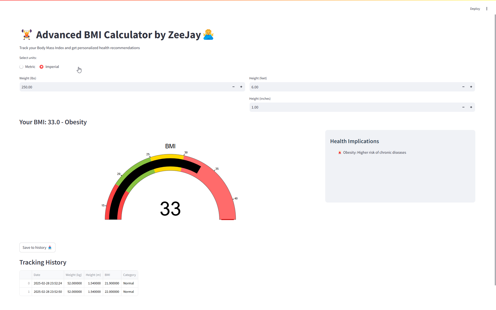
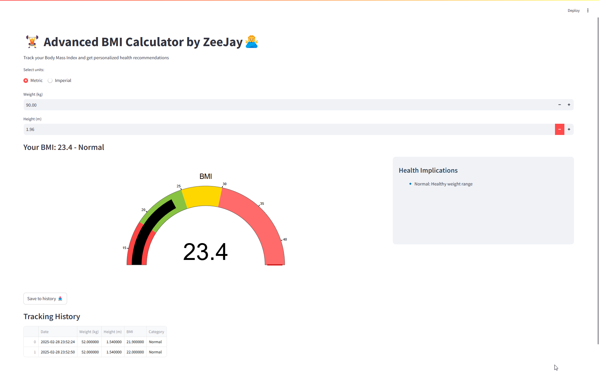

# Advanced BMI Calculator

## 🏋️ About the Project
The **Advanced BMI Calculator** is a web application built using **Streamlit** and **Plotly** that allows users to calculate their **Body Mass Index (BMI)** in both **Metric** and **Imperial** units. It provides real-time visualization, health implications, and history tracking for better monitoring.

## 🚀 Features
- **Metric & Imperial Units**: Choose between kilograms/meters or pounds/feet-inches.
- **BMI Calculation**: Automatically calculates BMI based on input values.
- **Health Categorization**: Classifies BMI into underweight, normal, overweight, and obesity categories.
- **Interactive Gauge Chart**: Uses Plotly to visualize BMI.
- **Health Recommendations**: Provides tailored health insights based on BMI.
- **History Tracking**: Stores BMI history for progress tracking.

## 🛠️ Technologies Used
- **Streamlit**: Web framework for Python applications.
- **Plotly**: Interactive visualizations.
- **Pandas**: Data handling and tracking.
- **Python**: Backend logic.

## 📷 Screenshots



## 🌐 Live Demo
[🔗 View the live project](#)

## 📥 Installation & Usage
1. **Clone the repository:**
   ```bash
   git clone https://github.com/zohaib-javd/advanced-bmi-calculator.git
   ```
2. **Navigate to the project folder:**
   ```bash
   cd advanced-bmi-calculator
   ```
3. **Install dependencies:**
   ```bash
   pip install -r requirements.txt
   ```
4. **Run the application:**
   ```bash
   streamlit run app.py
   ```

## 💬 Connect with me:
🔗 **LinkedIn**: [Zohaib Javed](https://www.linkedin.com/in/zohaib-javd)  
👨‍💻 **GitHub**: [zohaib-javd](https://www.github.com/zohaib-javd)  
📧 **Email**: zohaibjaved@gmail.com  
❎ **X (Twitter)**: [@zohaibjaved](https://x.com/zohaibjaved)  
📺 **YouTube**: [Zohaib Javed](https://www.youtube.com/@Zohaib-Javed)  

---
🎯 **Feel free to contribute, fork, or provide suggestions!** 🚀

